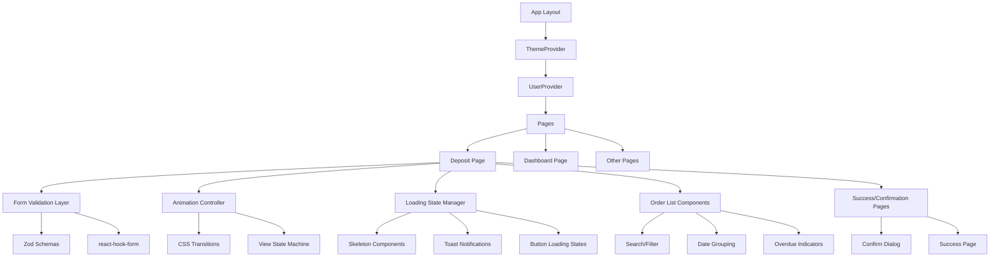
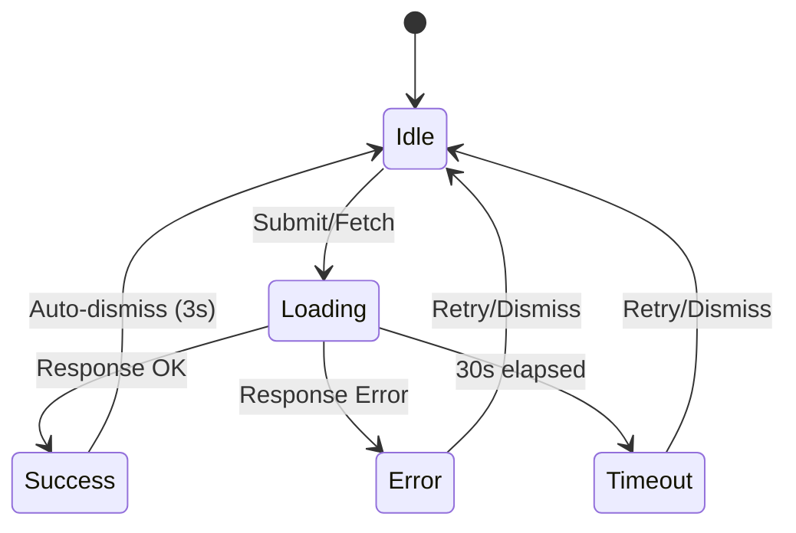
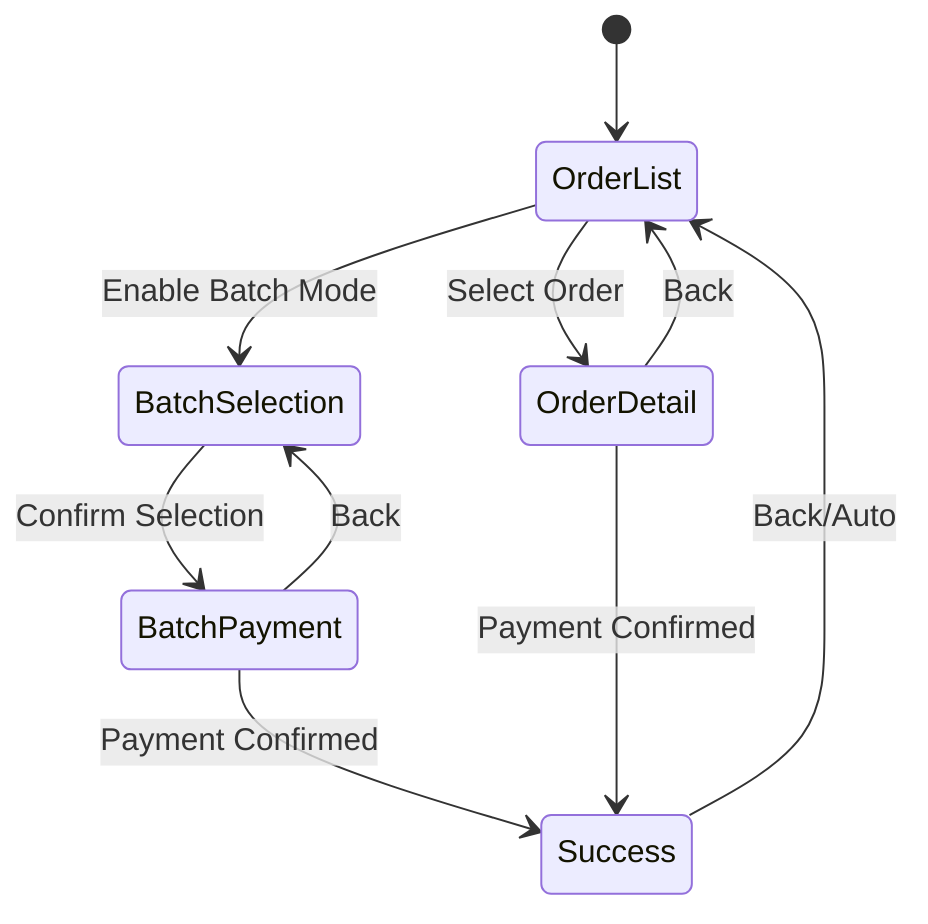

# Design Document: UI/UX Improvement

## Overview

Dokumen ini menjelaskan desain teknis untuk peningkatan UI/UX pada aplikasi OkeMitra (Driver Deposit App). Peningkatan mencakup loading states, form validation, animasi/transisi, navigasi, optimasi input mobile, tampilan daftar orderan, dark mode/theming, dan halaman sukses/konfirmasi.

Aplikasi ini menggunakan Next.js 16 dengan App Router, Capacitor untuk Android, Tailwind CSS v4 dengan CSS variables untuk theming, dan komponen UI berbasis Radix UI (shadcn/ui pattern). Desain ini membangun di atas arsitektur yang sudah ada tanpa mengubah stack teknologi.

### Design Decisions

1. **CSS-first animations**: Menggunakan CSS transitions dan `@keyframes` daripada library animasi tambahan (Framer Motion) untuk menjaga bundle size tetap kecil dan performa optimal di perangkat Android low-end.
2. **Existing component library**: Memanfaatkan komponen shadcn/ui yang sudah ada (Toast via Sonner, Dialog, Skeleton) daripada membuat dari nol.
3. **Zod untuk validation**: Menggunakan Zod yang sudah terinstall untuk schema validation, dikombinasikan dengan react-hook-form untuk form state management.
4. **CSS variables untuk theming**: Mempertahankan pendekatan CSS variables yang sudah ada di `globals.css` untuk dark mode tanpa flash.
5. **Local-first approach**: Menyimpan preferensi (tema, tipe orderan default, riwayat lokasi) di localStorage untuk pengalaman offline-friendly.

## Architecture

### High-Level Architecture



### State Management Flow



### Navigation State Machine (Deposit Page)



## Components and Interfaces

### New Components

#### 1. `SkeletonOrderList`
Skeleton loading placeholder untuk daftar orderan di tab setoran.

```typescript
interface SkeletonOrderListProps {
  count?: number // default 3
}
```

#### 2. `ToastNotification` (enhanced)
Menggunakan Sonner yang sudah terinstall, dengan konfigurasi tambahan untuk error toast dengan tombol retry.

```typescript
interface ToastConfig {
  type: 'success' | 'error' | 'warning'
  message: string
  duration?: number // default 3000ms for success, persistent for error
  action?: {
    label: string
    onClick: () => void
  }
}
```

#### 3. `FormField` (enhanced)
Wrapper untuk input field dengan inline validation error display.

```typescript
interface FormFieldProps {
  label: string
  error?: string
  touched?: boolean
  children: React.ReactNode
}
```

#### 4. `LocationAutocomplete`
Input field dengan autocomplete berdasarkan riwayat lokasi.

```typescript
interface LocationAutocompleteProps {
  value: string
  onChange: (value: string) => void
  onSelect: (value: string) => void
  placeholder: string
  history: LocationHistory[]
  icon?: React.ReactNode
  error?: string
}

interface LocationHistory {
  value: string
  frequency: number
}
```

#### 5. `StepIndicator`
Komponen indikator step untuk alur navigasi.

```typescript
interface StepIndicatorProps {
  steps: string[]
  currentStep: number
}
```

#### 6. `OrderCard` (enhanced)
Kartu orderan dengan indikator overdue dan animasi stagger.

```typescript
interface OrderCardProps {
  order: Order
  index: number
  isOverdue: boolean
  isSelected?: boolean
  onSelect?: () => void
  onClick?: () => void
}
```

#### 7. `SuccessPage`
Halaman sukses setelah setoran berhasil.

```typescript
interface SuccessPageProps {
  driverName: string
  amount: number
  route: string
  batchCount?: number
  onBack: () => void
}
```

#### 8. `CurrencyInput`
Input khusus untuk nilai mata uang dengan auto-formatting.

```typescript
interface CurrencyInputProps {
  value: number | string
  onChange: (value: number) => void
  min?: number
  max?: number
  error?: string
}
```

#### 9. `SwipeBackDetector`
Wrapper component untuk deteksi gesture swipe back.

```typescript
interface SwipeBackDetectorProps {
  enabled: boolean
  onSwipeBack: () => void
  children: React.ReactNode
}
```

### Modified Components

#### `MobileNav` (enhanced)
- Tambah indikator aktif yang lebih prominent (scale, background highlight)
- Tambah badge untuk notifikasi orderan tertunggak

#### `PullToRefresh` (existing, minor enhancement)
- Tambah timeout handling (30 detik)
- Tambah error state feedback

#### `ConfirmDialog` (enhanced)
- Tambah support untuk menampilkan detail jumlah dan orderan count
- Pastikan overlay memblokir interaksi

### Utility Functions

#### `formatCurrency(value: number): string`
Format angka ke format Rupiah dengan pemisah ribuan.

#### `parseCurrency(formatted: string): number`
Parse string format Rupiah kembali ke angka.

#### `isOverdue(orderDate: string, days: number): boolean`
Cek apakah orderan sudah melewati batas hari.

#### `filterOrders(orders: Order[], query: string): Order[]`
Filter orderan berdasarkan query pencarian (case-insensitive, partial match).

#### `groupOrdersByDate(orders: Order[]): GroupedOrders[]`
Kelompokkan orderan berdasarkan tanggal, terbaru di atas.

#### `getLocationSuggestions(input: string, history: LocationHistory[]): string[]`
Dapatkan saran lokasi berdasarkan input dan riwayat.

#### `validateOrderForm(data: OrderFormData): ValidationResult`
Validasi form orderan menggunakan Zod schema.

#### `calculateContrastRatio(color1: string, color2: string): number`
Hitung rasio kontras antara dua warna (untuk testing WCAG compliance).

## Data Models

### Form Validation Schema (Zod)

```typescript
import { z } from "zod"

export const orderFormSchema = z.object({
  lokasiMuat: z.string().min(1, "Lokasi muat wajib diisi").trim(),
  lokasiBongkar: z.string().min(1, "Lokasi bongkar wajib diisi").trim(),
  argo: z.number()
    .min(1000, "Nilai argo tidak valid (minimum Rp 1.000)")
    .max(999999999, "Nilai argo tidak valid (maksimum Rp 999.999.999)"),
  orderType: z.enum(["online", "offline"]),
  date: z.string().min(1, "Tanggal wajib diisi"),
  driverId: z.string().optional(),
})

export const fileUploadSchema = z.object({
  size: z.number().max(5 * 1024 * 1024, "Ukuran file maksimal 5MB"),
  type: z.enum(["image/jpeg", "image/jpg", "image/png"], {
    errorMap: () => ({ message: "Format file harus JPG atau PNG" })
  }),
})

export type OrderFormData = z.infer<typeof orderFormSchema>
export type FileUploadData = z.infer<typeof fileUploadSchema>
```

### Location History (localStorage)

```typescript
interface LocationHistoryStore {
  locations: {
    value: string
    frequency: number
    lastUsed: string // ISO date
  }[]
}
// Key: "location_history_{userId}"
```

### Theme Preference (localStorage)

```typescript
// Key: "theme"
// Value: "light" | "dark"
```

### Order Type Default (localStorage)

```typescript
// Key: "default_order_type"
// Value: "online" | "offline"
```

### Grouped Orders

```typescript
interface GroupedOrders {
  date: string // "DD MMM YYYY"
  dateRaw: Date
  orders: Order[]
}
```

### Validation Result

```typescript
interface ValidationResult {
  valid: boolean
  errors: Record<string, string>
}
```

## Correctness Properties

*A property is a characteristic or behavior that should hold true across all valid executions of a system — essentially, a formal statement about what the system should do. Properties serve as the bridge between human-readable specifications and machine-verifiable correctness guarantees.*

### Property 1: Required field validation rejects empty/whitespace input

*For any* string that consists entirely of whitespace characters (including empty string), the required field validator should return an error, and *for any* string containing at least one non-whitespace character, the validator should return no error.

**Validates: Requirements 2.1, 2.2, 2.8**

### Property 2: Argo range validation

*For any* numeric value, the argo validator should return valid if and only if the value is between 1000 and 999999999 (inclusive), and invalid otherwise.

**Validates: Requirements 2.3**

### Property 3: File upload validation

*For any* file with a given size and type, the file validator should reject files larger than 5MB OR files with types other than JPG/PNG, and accept files that are <= 5MB AND of type JPG or PNG.

**Validates: Requirements 2.4, 2.5**

### Property 4: Form submit button state is a function of field validity

*For any* combination of lokasiMuat, lokasiBongkar, and argo values, the submit button should be enabled if and only if all three fields pass their respective validation rules (non-empty for locations, within range for argo).

**Validates: Requirements 2.6**

### Property 5: Currency formatting round-trip

*For any* valid integer between 1000 and 999999999, formatting it with thousand separators and then parsing it back should yield the original number.

**Validates: Requirements 5.4**

### Property 6: Location autocomplete filtering and limiting

*For any* input string of length >= 2 and any list of location history entries, the returned suggestions should: (a) contain at most 5 items, (b) all contain the input string as a substring (case-insensitive), and (c) be sorted by frequency descending.

**Validates: Requirements 5.1**

### Property 7: Order search filter correctness

*For any* search query (length >= 1) and any list of orders, every order in the filtered result should contain the query string (case-insensitive) in at least one of: driver name, lokasi muat, lokasi bongkar, or order ID.

**Validates: Requirements 6.2**

### Property 8: Order grouping by date produces descending date order

*For any* list of orders with dates, grouping by date should produce groups where: (a) each group's orders all share the same date, (b) groups are ordered with the most recent date first, and (c) the total count of orders across all groups equals the input list length.

**Validates: Requirements 6.3**

### Property 9: Total sisa computation equals sum of individual sisa values

*For any* list of orders with sisa values, the computed total sisa should equal the arithmetic sum of all individual order sisa values.

**Validates: Requirements 6.1**

### Property 10: Overdue order detection

*For any* order creation date and current date, the order should be marked as overdue (red border) if and only if the difference in calendar days exceeds 7.

**Validates: Requirements 6.5**

### Property 11: Overdue badge count for dashboard

*For any* list of orders with dates and a current date, the badge count should equal the number of orders where the difference in calendar days exceeds 3.

**Validates: Requirements 4.6**

### Property 12: Theme persistence round-trip

*For any* valid theme value ("light" or "dark"), saving it to localStorage and reading it back should return the same theme value.

**Validates: Requirements 7.5**

### Property 13: Color contrast compliance

*For any* color pair (foreground, background) defined in the theme CSS variables, the computed contrast ratio should be >= 4.5:1 for normal text colors and >= 3:1 for large text and UI component borders.

**Validates: Requirements 7.3, 7.4**

### Property 14: Swipe back gesture detection

*For any* touch start position (startX) and horizontal swipe distance, the back navigation should trigger if and only if startX <= 20 AND distance >= 50.

**Validates: Requirements 4.4**

### Property 15: Success page displays correct deposit information

*For any* successful deposit (single or batch) with driver name, amount, and route information, the success page should display all provided values in the correct format (amount in Rupiah format, route as "lokasi muat → lokasi bongkar").

**Validates: Requirements 8.1, 8.4**

### Property 16: Form state preservation on submission failure

*For any* form state (uploaded file reference, pay amount), if the submission fails, the form state after the failure should be identical to the form state before submission.

**Validates: Requirements 8.6**

### Property 17: Form reset after successful order submission

*For any* form state before a successful order submission, after submission: lokasiMuat, lokasiBongkar, and argo should be empty/reset, orderType should return to the stored default, while driver and date fields should retain their previous values.

**Validates: Requirements 5.6**

### Property 18: Navigation active indicator correctness

*For any* valid route path in the application, exactly one navigation item in the bottom navigation should have the active state, and it should correspond to the matching route.

**Validates: Requirements 4.1**

## Error Handling

### Network Errors
- Semua API calls dibungkus dengan try/catch
- Timeout 30 detik menggunakan `AbortController` dengan `signal`
- Error toast persistent (tidak auto-dismiss) dengan tombol "Coba Lagi"
- Pesan error deskriptif: "Koneksi terputus", "Waktu permintaan habis", atau pesan dari server

### Form Validation Errors
- Validasi real-time on blur (setelah field disentuh)
- Error message ditampilkan di bawah field yang bermasalah
- Error hilang otomatis saat input diperbaiki (on change setelah touched)
- Submit button disabled sampai semua validasi pass

### File Upload Errors
- Validasi ukuran dan tipe sebelum upload
- Error message inline di area upload
- File yang ditolak tidak mengubah state sebelumnya

### Theme Errors
- Fallback ke light theme jika localStorage tidak tersedia
- Inline script di `<head>` untuk mencegah flash (FOUC prevention)
- Graceful degradation jika CSS variables tidak didukung

### Animation Errors
- `prefers-reduced-motion` media query untuk accessibility
- Animation cancellation saat navigasi baru terjadi
- Fallback ke instant transition jika animation API tidak tersedia

## Testing Strategy

### Unit Tests (Example-based)
- Loading state transitions (skeleton → content, button spinner)
- Toast notification appearance and dismissal
- Tab switching UI state
- Animation class application
- Step indicator rendering
- Batch mode UI elements
- Dialog overlay behavior
- Theme switching without reload
- FOUC prevention mechanism

### Property-Based Tests
Library: **fast-check** (TypeScript property-based testing library)
Configuration: Minimum 100 iterations per property test

Property tests akan mengcover:
1. Form validation logic (required fields, argo range, file validation)
2. Currency formatting round-trip
3. Location autocomplete filtering
4. Order search/filter correctness
5. Order date grouping
6. Total sisa computation
7. Overdue detection logic
8. Theme persistence
9. Color contrast calculations
10. Swipe gesture detection
11. Success page data display
12. Form state preservation/reset

Each test tagged with: `// Feature: ui-ux-improvement, Property {N}: {description}`

### Integration Tests
- Pull-to-refresh triggers API reload
- Submit flow end-to-end (form → API → success page)
- Theme change persists across page navigation
- Keyboard viewport adjustment on mobile

### Manual/Visual Tests
- Animation smoothness and timing
- Dark mode visual consistency across all pages
- Touch feedback responsiveness
- Stagger animation visual quality
- WCAG contrast verification with browser dev tools
